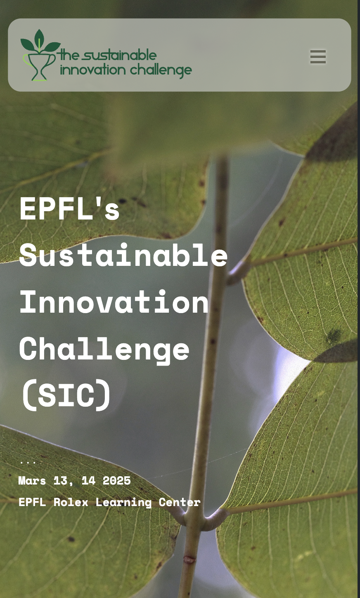

# sustainable-innovation-challenge.com

## Development environment setup

Requirements: 
- node 
- npm 

Install the depencies:
```
npm install 
```

Start the development server:
```
npm run start
```

Deploy:
```
npm run deploy
```

## Visuals



